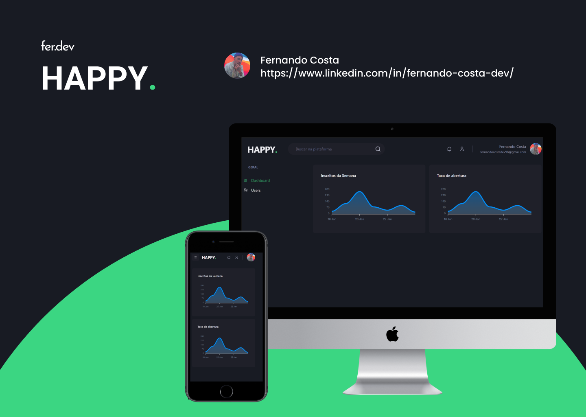

<h1 align="center">
  
</h1>

<h3 align="center">
  HAPPY - Simple dashboard just to improve my skills.
</h3>
<br>

>Project developed using TypeScript, with the intention of applying new concepts I learned using NextJS, and responsive web Design with ChakraUI.

<p align="center">
  
</p>

<!-- Table of Contents -->
## Table of Contents

* [About the Project](#about-the-project)
  * [Technologies](#technologies)
    * [Web](#web)
* [Getting Started](#getting-started)
  * [Requirements](#requirements)
  * [Installation](#installation)
* [License](#license)
* [Contact](#contact)

<!-- About the Project -->
## About the Project

Happy is a basic dashboard system created to improve some of the skills I'm learning. All built with responsive web design.

I used the mirageJS library, which lets frontend developers mock out backend APIs.

This library was used to create HTTP routes for creating, editing and removing users, and some functionality provided by the library, such as 'factories'.


### Technologies

> See now the technologies that I used during the construction of the system 


#### Web

- Axios
- MirageJS
- Faker
- React Hook Form
- yup 
- ChakraUI
- React Query
- React Icons
- NextJS
- React Apex Charts


<!-- Getting Started -->
## Getting Started

>For the applications to work, some tools installed on your machine are required.

### Requirements

- [Node.js](https://nodejs.org/en/)
- [NextJS](https://nextjs.org/)

### Installation

**First clone the project**

```sh
  git clone https://github.com/l-fernandocosta/happy-project
```

_Install the dependencies_

```sh
  yarn
```

**Launch the web application**

```sh
  yarn start
```

<!-- License -->
## License
This project is licensed under the [MIT License](LICENSE)

## Contact
You can connect and talk to me through my [LinkedIn](https://www.linkedin.com/in/fernando-costa-dev/).
